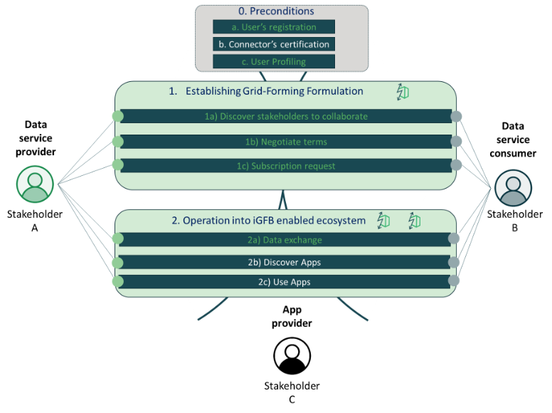

**WeForming MVP1.0**

This repository presents the first MVP (1.0) of WeForming project implemented as of 31st October '24. The currently implemented use cases are illustration in the overall conceptual schematic below

This repository is comprised of:
- [WeForming Middleware] the WeForming Middleware which is responsible as the facilitator in iGFB enabled data space ecosyterm
- [WeForming Connector].

