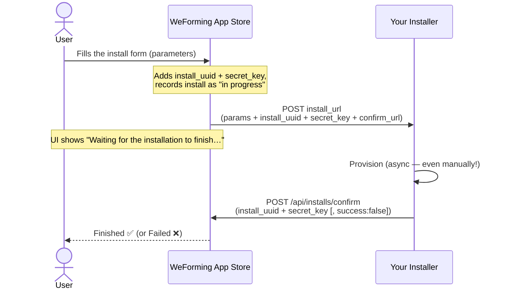

# Installing an App — Flow

*How the WeForming App Store collects parameters and drives your installer.*

When a user installs your app, the store shows them a form **you** define, then hands the
collected data to **your** installer and waits for it to report back. Three moving parts:

- a **JSON Schema** — the form, rendered with [JSON Forms](https://jsonforms.io/);
- an **install URL** — where the data is POSTed;
- a **confirm callback** — how your installer says *"done"*.

---

## Big picture



The store never installs anything itself — it collects the parameters, forwards them to your
**install URL**, and waits for your **confirm** callback.

---

## 1. Define the install form with a JSON Schema

Paste a JSON Schema into **Installation parameters** on the Publish form. It is stored with the
app and rendered as the **Parameters** step of the install wizard using
[JSON Forms](https://jsonforms.io/) — titles become labels, `required` fields are enforced, and
`pattern`/type rules validate input before install.

```json
{
  "type": "object",
  "properties": {
    "ip_address": {
      "type": "string",
      "title": "IP address",
      "pattern": "^([0-9]{1,3}[.]){3}[0-9]{1,3}$"
    }
  },
  "required": ["ip_address"]
}
```

The example above renders as a single required **IP address** field, validated live as the user
types.

---

## 2. The install flow, step by step

| # | Who | What happens |
| :-: | --- | --- |
| 1 | **User** | Launches the wizard: intro → select an asset (the store checks the asset supports your app's platform) → parameters → review. |
| 2 | **Store · frontend** | Your form is rendered from the JSON Schema; the user fills it in. |
| 3 | **Store · frontend** | On **Install**, the collected values are POSTed to the backend at `POST /api/user-apps/`. |
| 4 | **Store · backend** | Generates a unique `install_uuid` + `secret_key`, injects them into the form data, and records the install as **in progress**. |
| 5 | **Store · backend → your installer** | The augmented JSON is **POSTed to your app's `install_url`** (see §3). |
| 6 | **Store · frontend** | The user sees **"Waiting for the installation to finish…"** while the frontend polls `GET /api/installs/{uuid}`. Reloading resumes the wait. |
| 7 | **Your installer** | Does the actual work — it can take as long as needed; nothing is blocked. **You can even install manually. No problem!** |
| 8 | **Your installer → /confirm** | When done it calls `POST /api/installs/confirm` with the `install_uuid` + `secret_key`. **No login required** — the secret authorizes it. |
| 9 | **User** | Status flips to **finished** (or **failed**). The waiting screen resolves and **My Apps** shows the status chip. |

---

## 3. What your `install_url` receives

The store POSTs the user's form values **plus** identifiers it generates:

```jsonc
// POST from the store to your install_url
{
  // ── the user's form values ──
  "ip_address": "192.168.1.50",

  // ── added by the store ──
  "install_uuid": "6769f47a-…-208432962dc4",
  "secret_key":   "ix6sO2wo…Z1lyIM",
  "confirm_url":  "https://your-store/api/installs/confirm"
}
```

When finished, call back (unauthenticated):

```bash
# success (default):
curl -X POST https://your-store/api/installs/confirm \
  -H "Content-Type: application/json" \
  -d '{"install_uuid":"…","secret_key":"…"}'

# …or report a failure:
curl -X POST https://your-store/api/installs/confirm \
  -H "Content-Type: application/json" \
  -d '{"install_uuid":"…","secret_key":"…","success":false}'
```

> **Keep the `secret_key` private.** Anyone holding it for a given `install_uuid` can mark that
> install complete — which is exactly why the callback needs no other auth.

---

## 4. Endpoints at a glance

| Endpoint | Auth | Purpose |
| --- | --- | --- |
| `POST <your install_url>` | your choice | Receives the install request: the user's form values + `install_uuid` + `secret_key` + `confirm_url`. |
| `POST /api/installs/confirm` | none — secret-guarded | Your installer marks the install **finished** (default) or **failed** (`success:false`). |
| `GET /api/installs/{uuid}` | the installing user | Polled by the wizard to detect completion (you don't call this). |
