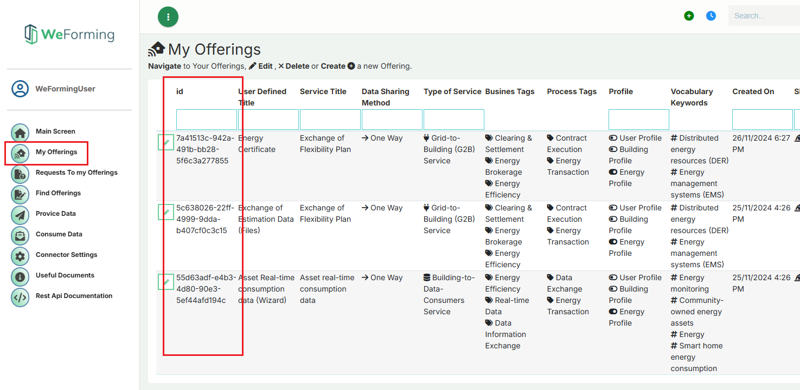

# WeForming Connector

The **WeForming Connector** is built on top of the **Eclipse Dataspace Connector (EDC)** and acts as the backbone for secure, standardized, and policy-driven data exchange within the WeForming ecosystem. It enables each participant to independently manage, store, and share their data in a sovereign and controlled way.

### By leveraging the EDC, the connector ensures

  - **Data sovereignty**: Each participant retains full control over their data, deciding what to share, with whom, and under which conditions
  - **Security & compliance**: All data transfers are secured and governed by configurable policies, aligned with modern data-sharing standards like IDS and Gaia-X.
  - **Interoperability**: Seamless integration across systems and participants, enabling scalable and decentralized collaboration.
  - **Auditability**: Traceable contract negotiation and transfer processes provide transparency and accountability.

### We provide two options

  **Option 1**: Shared cloud-hosted connectors, managed by European Dynamics.
  
  **Option 2** : The ability for each participant to deploy their own connector by following the instructions below

*For both options kindly contact konstantinos.kotsalos@eurodyn.com & stratis.kanarachos@eurodyn.com for creating user credentials for the Middleware; on your request indicate the number of user accounts, affiliation and email contact, as well as if you plan to assign them with a cloud-host connector*

# Requirements

To run the project you will need:
- Install Docker on your system


# Setup & Usage

### Clone the repository 

```
git clone https://github.com/european-dynamics-rnd/weforming.git
cd weforming/WeForming_Connector
```

### Start the services
Option A: Using Docker Compose directly
```
docker compose -f docker-compose_Postgres.yml up --build -d
```
Option B: Using Makefile commands
```
make containers-start
```
To restart the services (without removing volumes)
```
make containers-restart
```

## Port Mapping
Each connector instance exposes a set of well-defined API endpoints on dedicated ports. These endpoints serve different roles in the connector’s lifecycle — including control, communication, management, and data exchange. Below is the default port configuration used in the WeForming Connector setup:

| Description | Port | Path | Purpose |
| :---------------- | :------: | :---- | :---- |
| Management | 8003 | /management | Used for internal configuration, extension registration, and system health |
| Control | 8005 | /control | Handles contract negotiation and transfer process coordination  |
| Protocol | 8004 | /protocol | Manages IDS protocol communication between connectors |
| Public | 8002 | /public | Used for exposing open APIs and endpoint registration |
| Handler | 15588 | /handler | Backend service endpoint for file storage and pull request reception |

**Important note**: Make sure these ports are open and not occupied by other processes on your system.

In the demo setup, the connector uses the default port mapping as shown above.

## Health Check
To verify that the backend handler service is running correctly, you can access its health check endpoint
```
GET http://<connector-host>:15588/handler/health
```

## Exposing the Connector via a Reverse Proxy

To securely expose the connector endpoints over HTTPS, you will need:

  - A **domain name** pointing to your connector host

  - A valid **SSL/TLS certificate** (e.g., from Let's Encrypt or another CA)

This setup is essential to support secure external communication and is especially critical when interacting with federated or production environments.

You can use a reverse proxy (e.g., **Nginx**, **HAProxy**, or a **cloud load balancer**) to:

  - Route external HTTPS traffic to internal HTTP ports

  - Centralize TLS termination and security policies

  - Maintain a clean public interface without exposing internal infrastructure

Here’s a real-world configuration example:

| Connector Interface	 | Frontend (Public URL) | Backend (Internal URL) |
| :---------------- | :------: | :---- |
| Handler | https://weforming-connector-sec.eurodyn.com/handler | http://weforming-connector-server.eurodyn.com:15588 | 
| Public | https://weforming-connector-sec.eurodyn.com/public | http://weforming-connector-server.eurodyn.com:8002 |
| Management | https://weforming-connector-sec.eurodyn.com/management | http://weforming-connector-server.eurodyn.com:8003 |
| Protocol | https://weforming-connector-sec.eurodyn.com/protocol | http://weforming-connector-server.eurodyn.com:8004 |
| Control | https://weforming-connector-sec.eurodyn.com/control | http://weforming-connector-server.eurodyn.com:8005 |

## Provide Data to WeForming Programmatically

In addition to the UI, you can provide data to a WeForming programmatically using simple HTTP endpoints. This is especially useful for automated integrations or continuous data ingestion.

The following Python example demonstrates how to:

### Authenticate with the WeForming backend with your credentials to obtain a token 

You first authenticate with the weformings API to receive a JWT bearer token, which is required to authorize your data submission. The authentication is done using a POST request with a simple payload containing your ```username``` and ```password```.

#### Authentication Endpoint
```
POST https://weforming-mid.eurodyn.com/api/user/auth/token
```
#### Body
```
{
  "username": "<Your Username>",
  "password": "<Your Password>"
}
```
#### Returns
```
{
  "accessToken": "<JWT_TOKEN>"
}
```

The access token should be included as a Bearer token in the Authorization header when calling protected APIs

### Provide Data for one of your offerings

Once authenticated, you can send base64-encoded data to the backend using the /api/asset/provide endpoint. This endpoint accepts a structured JSON payload and registers the file as an asset in the connector and its metadata information under the specified offering in the weforming central application.

#### Data Submission Endpoint

```
POST http://connector_local:15588/handler/asset/provide
```

If you are using one of our cloud connectors you can call the 


``` POST https://weforming-connector.eurodyn.com/handler/asset/provide ```
or 
``` POST https://weforming-connector-sec.eurodyn.com/handler/asset/provide ```

#### Headers

```
Authorization: Bearer <JWT_TOKEN>
Content-Type: application/json
```

#### Payload
```
{
  "provide_data_obj": {
    "file": "data:application/json;base64,<base64_encoded_data>",
    "file_name": "example.json",
    "title": "My Data Title",
    "description": "Optional description",
    "service_offering_id": "<service_offering_id>"
  }
}
```

### How to Get the ```service_offering_id```
To provide data to a specific offering, you need to locate its UUID:

1. Go to the WeForming frontend UI
2. Login with your credentials
3. In the sidebar, click “My Offerings.”
4. You’ll see a list of your existing service offerings
5. Select the ID (UUID) of the offering you want to provide data for.

*Note: You may also get the service offering IDs via API, see on Middleware GUI the REST API documentation and call Get My Offerings List.*




### Provide Data Programmatically with a Python Sample script

A full working script is provided below. It performs authentication and posts a dataset to the backend in a loop. Make sure to update the endpoints and service_offering_id accordingly

```
import requests
import time
import base64
import json

# Define API endpoints
AUTH_URL = "https://weforming-mid.eurodyn.com/api/user/auth/token"
DATA_URL = "http://localhost:15588/handler/asset/provide"
# DATA_URL = "https://weforming-connector-sec.eurodyn.com/handler/asset/provide"
SERVICE_OFFERING_ID = "your offering id"

# Authentication credentials
AUTH_PAYLOAD = {
    "username": "your username",
    "password": "your password"
}

DATA_PAYLOAD = {
    "provide_data_obj": {
        "file": "data:application/json;base64,eyJpZCI6OTEsIm5hbWUiOiJSaXNrIEFzc2Vzc21lbnQgW1Bhc3NlbmhlciBtb2JpbGUgZGV2aWNlXSIsImNyZWF0ZWRfb24iOiIyMDIyLTEyLTI5VDEwOjQxOjU2WiIsImluY2x1ZGVfZ2VuZXJpYyI6MCwic2VydmljZXMiOlt7ImlkIjo5NiwibmFtZSI6IlBNRC0wMSIsImltcGFjdCI6eyJjb25maWRlbnRpYWxpdHkiOjUsImludGVncml0eSI6MTAsImF2YWlsYWJpbGl0eSI6OX0sImNvbW11bmljYXRpb25fbGlua3MiOltdLCJjb21wb3NpdGVfYXNzZXRzIjpbeyJpZCI6MywibmFtZSI6InBhc3Nlbmdlci1tb2JpbGUtZGV2aWNlLTAxIiwiZWNvbm9taWMiOnsicGVzc2ltaXN0aWMiOjIwMDAsImNvbW1vbiI6MTAwMCwib3B0aW1pc3RpYyI6ODAwfSwiY29tbXVuaWNhdGlvbl9saW5rcyI6W3siaWQiOjMsInR5cGUiOiJ1c2VzIiwiYmFzaWNfaWRfc291cmNlIjo1LCJiYXNpY19pZF9kZXN0aW5hdGlvbiI6OX0seyJpZCI6NCwidHlwZSI6ImludGVyYWN0c193aXRoIiwiYmFzaWNfaWRfc291cmNlIjoxMCwiYmFzaWNfaWRfZGVzdGluYXRpb24iOjh9XSwiYmFzaWNfYXNzZXRzIjpbeyJpZCI6NSwibmFtZSI6Im5hdGl2ZS1hcGkiLCJkZXNjcmlwdGlvbiI6bnVsbCwidHlwZV9pZCI6NDczLCJ0eXBlIjoiQVMtT1MtMDIiLCJjYXRlZ29yeSI6ImEiLCJ2ZW5kb3IiOiJhbmRyb2lkIiwicHJvZHVjdCI6ImFuZHJvaWRfc2RrIiwidmVyc2lvbiI6Iio6KjoqOio6KjoqOio6KiIsImNwZSI6ImNwZToyLjM6YTphbmRyb2lkOmFuZHJvaWRfc2RrOio6KjoqOio6KjoqOio6KiIsInRocmVhdHMiOlt7ImlkIjoxLCJjb2RlIjoiVEgtMDEiLCJuYW1lIjoiTWFsd2FyZSBJbmplY3Rpb24iLCJkZXNjcmlwdGlvbiI6IjU3Iiwib2NjdXJyZW5jZSI6MiwiaW1wYWN0Ijp7ImNvbmZpZGVudGlhbGl0eSI6dHJ1ZSwiaW50ZWdyaXR5Ijp0cnVlLCJhdmFpbGFiaWxpdHkiOnRydWV9LCJjb3VudGVybWVhc3VyZXMiOlt7ImlkIjo0LCJjb2RlIjoiQ00tT1MtcGF0Y2hpbmciLCJuYW1lIjoiUGVyZm9ybWluZyByZWd1bGFyIE9TIHVwZGF0ZXMiLCJjaXNDb250cm9sIjp7ImlkIjo1NSwiY29kZSI6IjcuMyIsInRpdGxlIjoiUGVyZm9ybSBBdXRvbWF0ZWQgT3BlcmF0aW5nIFN5c3RlbSBQYXRjaCBNYW5hZ2VtZW50Iiwic2VjdXJpdHlfZnVuY3Rpb24iOiJQcm90ZWN0IiwiY2lzX2Fzc2V0X3R5cGUiOiJBcHBsaWNhdGlvbnMifSwiZWZmaWNpZW5jeSI6eyJjb25maWRlbnRpYWxpdHkiOjEsImludGVncml0eSI6MSwiYXZhaWxhYmlsaXR5IjoxfX1dLCJyaXNrIjpbXSwic2NvcmVfc3VtIjowfSx7ImlkIjoyLCJjb2RlIjoiVEgtMDIiLCJuYW1lIjoiRGVuaWFsIG9mIFNlcnZpY2UiLCJkZXNjcmlwdGlvbiI6IjU4Iiwib2NjdXJyZW5jZSI6MiwiaW1wYWN0Ijp7ImNvbmZpZGVudGlhbGl0eSI6ZmFsc2UsImludGVncml0eSI6ZmFsc2UsImF2YWlsYWJpbGl0eSI6dHJ1ZX0sImNvdW50ZXJtZWFzdXJlcyI6W10sInJpc2siOltdLCJzY29yZV9zdW0iOjB9LHsiaWQiOjksImNvZGUiOiJUSC0wOSIsIm5hbWUiOiJGYWlsdXJlIG9mIFN5c3RlbSIsImRlc2NyaXB0aW9uIjoiNTkiLCJvY2N1cnJlbmNlIjoyLCJpbXBhY3QiOnsiY29uZmlkZW50aWFsaXR5IjpmYWxzZSwiaW50ZWdyaXR5IjpmYWxzZSwiYXZhaWxhYmlsaXR5Ijp0cnVlfSwiY291bnRlcm1lYXN1cmVzIjpbXSwicmlzayI6W10sInNjb3JlX3N1bSI6MH0seyJpZCI6OSwiY29kZSI6IlRILTA5IiwibmFtZSI6IkZhaWx1cmUgb2YgU3lzdGVtIiwiZGVzY3JpcHRpb24iOiI2MCIsIm9jY3VycmVuY2UiOjIsImltcGFjdCI6eyJjb25maWRlbnRpYWxpdHkiOmZhbHNlLCJpbnRlZ3JpdHkiOmZhbHNlLCJhdmFpbGFiaWxpdHkiOnRydWV9LCJjb3VudGVybWVhc3VyZXMiOltdLCJyaXNrIjpbXSwic2NvcmVfc3VtIjowfSx7ImlkIjoxMSwiY29kZSI6IlRILTExIiwibmFtZSI6IlNvZnR3YXJlIEV4cGxvaXRhdGlvbiAvIE1hbGljaW91cyBDb2RlIEluamVjdGlvbiIsImRlc2NyaXB0aW9uIjoiNjEiLCJvY2N1cnJlbmNlIjoyLCJpbXBhY3QiOnsiY29uZmlkZW50aWFsaXR5Ijp0cnVlLCJpbnRlZ3JpdHkiOnRydWUsImF2YWlsYWJpbGl0eSI6dHJ1ZX0sImNvdW50ZXJtZWFzdXJlcyI6W10sInJpc2siOltdLCJzY29yZV9zdW0iOjB9LHsiaWQiOjE0LCJjb2RlIjoiVEgtMTQiLCJuYW1lIjoiRGV2aWNlIE1vZGlmaWNhdGlvbiIsImRlc2NyaXB0aW9uIjoiNjIiLCJvY2N1cnJlbmNlIjoyLCJpbXBhY3QiOnsiY29uZmlkZW50aWFsaXR5Ijp0cnVlLCJpbnRlZ3JpdHkiOnRydWUsImF2YWlsYWJpbGl0eSI6dHJ1ZX0sImNvdW50ZXJtZWFzdXJlcyI6W10sInJpc2siOltdLCJzY29yZV9zdW0iOjB9LHsiaWQiOjIxLCJjb2RlIjoiVEgtMjEiLCJuYW1lIjoiUmVzb3VyY2UgRXhoYXVzdGlvbi9MYWNrIG9mIHJlc291cmNlcyIsImRlc2NyaXB0aW9uIjoiNjMiLCJvY2N1cnJlbmNlIjoyLCJpbXBhY3QiOnsiY29uZmlkZW50aWFsaXR5IjpmYWxzZSwiaW50ZWdyaXR5IjpmYWxzZSwiYXZhaWxhYmlsaXR5Ijp0cnVlfSwiY291bnRlcm1lYXN1cmVzIjpbXSwicmlzayI6W10sInNjb3JlX3N1bSI6MH0seyJpZCI6MjIsImNvZGUiOiJUSC0yMiIsIm5hbWUiOiJJc29sYXRpb24vVmlydHVhbGl6YXRpb24gQWJ1c2UiLCJkZXNjcmlwdGlvbiI6IjY0Iiwib2NjdXJyZW5jZSI6MiwiaW1wYWN0Ijp7ImNvbmZpZGVudGlhbGl0eSI6dHJ1ZSwiaW50ZWdyaXR5Ijp0cnVlLCJhdmFpbGFiaWxpdHkiOnRydWV9LCJjb3VudGVybWVhc3VyZXMiOltdLCJyaXNrIjpbXSwic2NvcmVfc3VtIjowfSx7ImlkIjoyMywiY29kZSI6IlRILTIzIiwibmFtZSI6Ik1hbmFnZW1lbnQgSW50ZXJmYWNlIENvbXByb21pc2UiLCJkZXNjcmlwdGlvbiI6IjY1Iiwib2NjdXJyZW5jZSI6MiwiaW1wYWN0Ijp7ImNvbmZpZGVudGlhbGl0eSI6dHJ1ZSwiaW50ZWdyaXR5Ijp0cnVlLCJhdmFpbGFiaWxpdHkiOnRydWV9LCJjb3VudGVybWVhc3VyZXMiOltdLCJyaXNrIjpbXSwic2NvcmVfc3VtIjowfSx7ImlkIjoyNCwiY29kZSI6IlRILTI0IiwibmFtZSI6IlVuYXV0aG9yaXplZCBBY2Nlc3MgdG8gUHJlbWlzZXMiLCJkZXNjcmlwdGlvbiI6IjY2Iiwib2NjdXJyZW5jZSI6MiwiaW1wYWN0Ijp7ImNvbmZpZGVudGlhbGl0eSI6dHJ1ZSwiaW50ZWdyaXR5Ijp0cnVlLCJhdmFpbGFiaWxpdHkiOnRydWV9LCJjb3VudGVybWVhc3VyZXMiOltdLCJyaXNrIjpbXSwic2NvcmVfc3VtIjowfSx7ImlkIjoyNSwiY29kZSI6IlRILTI1IiwibmFtZSI6IkFidXNlIG9mIEF1dGhvcmlzYXRpb24gLyBQcml2aWxlZ2UgRXNjYWxhdGlvbiIsImRlc2NyaXB0aW9uIjoiNjciLCJvY2N1cnJlbmNlIjoyLCJpbXBhY3QiOnsiY29uZmlkZW50aWFsaXR5Ijp0cnVlLCJpbnRlZ3JpdHkiOnRydWUsImF2YWlsYWJpbGl0eSI6dHJ1ZX0sImNvdW50ZXJtZWFzdXJlcyI6W10sInJpc2siOltdLCJzY29yZV9zdW0iOjB9LHsiaWQiOjI3LCJjb2RlIjoiVEgtMjciLCJuYW1lIjoiQWJ1c2Ugb2YgQXV0aGVudGljYXRpb24iLCJkZXNjcmlwdGlvbiI6IjY4Iiwib2NjdXJyZW5jZSI6MiwiaW1wYWN0Ijp7ImNvbmZpZGVudGlhbGl0eSI6dHJ1ZSwiaW50ZWdyaXR5Ijp0cnVlLCJhdmFpbGFiaWxpdHkiOnRydWV9LCJjb3VudGVybWVhc3VyZXMiOltdLCJyaXNrIjpbXSwic2NvcmVfc3VtIjowfSx7ImlkIjoyOCwiY29kZSI6IlRILTI4IiwibmFtZSI6IklkZW50aXR5IFRoZWZ0IiwiZGVzY3JpcHRpb24iOiI2OSIsIm9jY3VycmVuY2UiOjIsImltcGFjdCI6eyJjb25maWRlbnRpYWxpdHkiOnRydWUsImludGVncml0eSI6dHJ1ZSwiYXZhaWxhYmlsaXR5IjpmYWxzZX0sImNvdW50ZXJtZWFzdXJlcyI6W10sInJpc2siOltdLCJzY29yZV9zdW0iOjB9LHsiaWQiOjI4LCJjb2RlIjoiVEgtMjgiLCJuYW1lIjoiSWRlbnRpdHkgVGhlZnQiLCJkZXNjcmlwdGlvbiI6IjcwIiwib2NjdXJyZW5jZSI6MiwiaW1wYWN0Ijp7ImNvbmZpZGVudGlhbGl0eSI6dHJ1ZSwiaW50ZWdyaXR5Ijp0cnVlLCJhdmFpbGFiaWxpdHkiOmZhbHNlfSwiY291bnRlcm1lYXN1cmVzIjpbXSwicmlzayI6W10sInNjb3JlX3N1bSI6MH0seyJpZCI6MjksImNvZGUiOiJUSC0yOSIsIm5hbWUiOiJTb2NpYWwgRW5naW5lZXJpbmciLCJkZXNjcmlwdGlvbiI6IjcxIiwib2NjdXJyZW5jZSI6MiwiaW1wYWN0Ijp7ImNvbmZpZGVudGlhbGl0eSI6dHJ1ZSwiaW50ZWdyaXR5Ijp0cnVlLCJhdmFpbGFiaWxpdHkiOnRydWV9LCJjb3VudGVybWVhc3VyZXMiOltdLCJyaXNrIjpbXSwic2NvcmVfc3VtIjowfSx7ImlkIjoyOSwiY29kZSI6IlRILTI5IiwibmFtZSI6IlNvY2lhbCBFbmdpbmVlcmluZyIsImRlc2NyaXB0aW9uIjoiNzIiLCJvY2N1cnJlbmNlIjoyLCJpbXBhY3QiOnsiY29uZmlkZW50aWFsaXR5Ijp0cnVlLCJpbnRlZ3JpdHkiOnRydWUsImF2YWlsYWJpbGl0eSI6dHJ1ZX0sImNvdW50ZXJtZWFzdXJlcyI6W10sInJpc2siOltdLCJzY29yZV9zdW0iOjB9LHsiaWQiOjEzMiwiY29kZSI6IlRocmVhdCBUZXN0IiwibmFtZSI6IlRocmVhdCBUZXN0IiwiZGVzY3JpcHRpb24iOiIxNjU3Iiwib2NjdXJyZW5jZSI6MiwiaW1wYWN0Ijp7ImNvbmZpZGVudGlhbGl0eSI6dHJ1ZSwiaW50ZWdyaXR5IjpmYWxzZSwiYXZhaWxhYmlsaXR5IjpmYWxzZX0sImNvdW50ZXJtZWFzdXJlcyI6W10sInJpc2siOltdLCJzY29yZV9zdW0iOjB9LHsiaWQiOjEzMywiY29kZSI6IlNPQVItMDEiLCJuYW1lIjoiU09BUiBUaHJlYXQiLCJkZXNjcmlwdGlvbiI6IjE2ODgiLCJvY2N1cnJlbmNlIjoyLCJpbXBhY3QiOnsiY29uZmlkZW50aWFsaXR5Ijp0cnVlLCJpbnRlZ3JpdHkiOnRydWUsImF2YWlsYWJpbGl0eSI6dHJ1ZX0sImNvdW50ZXJtZWFzdXJlcyI6W10sInJpc2siOltdLCJzY29yZV9zdW0iOjB9LHsiaWQiOjEzNCwiY29kZSI6IlNPQVItMDIiLCJuYW1lIjoiU09BUiBUaHJlYXQgMDIiLCJkZXNjcmlwdGlvbiI6IjE3NTEiLCJvY2N1cnJlbmNlIjoyLCJpbXBhY3QiOnsiY29uZmlkZW50aWFsaXR5Ijp0cnVlLCJpbnRlZ3JpdHkiOnRydWUsImF2YWlsYWJpbGl0eSI6dHJ1ZX0sImNvdW50ZXJtZWFzdXJlcyI6W10sInJpc2siOltdLCJzY29yZV9zdW0iOjB9LHsiaWQiOjEzNiwiY29kZSI6IklOU1RBTExfTk9OX01BUktFVF9BUFBTX0FMTE9XRUQiLCJuYW1lIjoiSU5TVEFMTF9OT05fTUFSS0VUX0FQUFNfQUxMT1dFRCIsImRlc2NyaXB0aW9uIjoiMTg1MyIsIm9jY3VycmVuY2UiOjIsImltcGFjdCI6eyJjb25maWRlbnRpYWxpdHkiOmZhbHNlLCJpbnRlZ3JpdHkiOnRydWUsImF2YWlsYWJpbGl0eSI6ZmFsc2V9LCJjb3VudGVybWVhc3VyZXMiOltdLCJyaXNrIjpbXSwic2NvcmVfc3VtIjowfSx7ImlkIjoxMzcsImNvZGUiOiJERVZJQ0VfUEFTU1dPUkRfUVVBTElUWV9MT1ciLCJuYW1lIjoiREVWSUNFX1BBU1NXT1JEX1FVQUxJVFlfTE9XIiwiZGVzY3JpcHRpb24iOiIxOTE2Iiwib2NjdXJyZW5jZSI6MiwiaW1wYWN0Ijp7ImNvbmZpZGVudGlhbGl0eSI6ZmFsc2UsImludGVncml0eSI6dHJ1ZSwiYXZhaWxhYmlsaXR5IjpmYWxzZX0sImNvdW50ZXJtZWFzdXJlcyI6W10sInJpc2siOltdLCJzY29yZV9zdW0iOjB9LHsiaWQiOjEzOCwiY29kZSI6IlVTQl9ERUJVR19PTiIsIm5hbWUiOiJVU0JfREVCVUdfT04iLCJkZXNjcmlwdGlvbiI6IjE5NzkiLCJvY2N1cnJlbmNlIjoyLCJpbXBhY3QiOnsiY29uZmlkZW50aWFsaXR5IjpmYWxzZSwiaW50ZWdyaXR5Ijp0cnVlLCJhdmFpbGFiaWxpdHkiOmZhbHNlfSwiY291bnRlcm1lYXN1cmVzIjpbXSwicmlzayI6W10sInNjb3JlX3N1bSI6MH1dLCJoYXNfY3VzdG9tX3Jpc2siOjB9LHsiaWQiOjYsIm5hbWUiOiJvcy1zZXJ2aWNlcyIsImRlc2NyaXB0aW9uIjpudWxsLCJ0eXBlX2lkIjo0NzUsInR5cGUiOiJBUy1PUy0wNCIsImNhdGVnb3J5IjoiaCIsInZlbmRvciI6Im5ldGZpbHRlciIsInByb2R1Y3QiOiJjb25udHJhY2stdG9vbHMiLCJ2ZXJzaW9uIjoiKjoqOio6KjoqOio6KjoqIiwiY3BlIjoiY3BlOjIuMzpoOm5ldGZpbHRlcjpjb25udHJhY2stdG9vbHM6KjoqOio6KjoqOio6KjoqIiwidGhyZWF0cyI6W3siaWQiOjEsImNvZGUiOiJUSC0wMSIsIm5hbWUiOiJNYWx3YXJlIEluamVjdGlvbiIsImRlc2NyaXB0aW9uIjoiNzQiLCJvY2N1cnJlbmNlIjoyLCJpbXBhY3QiOnsiY29uZmlkZW50aWFsaXR5Ijp0cnVlLCJpbnRlZ3JpdHkiOnRydWUsImF2YWlsYWJpbGl0eSI6dHJ1ZX0sImNvdW50ZXJtZWFzdXJlcyI6W3siaWQiOjQsImNvZGUiOiJDTS1PUy1wYXRjaGluZyIsIm5hbWUiOiJQZXJmb3JtaW5nIHJlZ3VsYXIgT1MgdXBkYXRlcyIsImNpc0NvbnRyb2wiOnsiaWQiOjU1LCJjb2RlIjoiNy4zIiwidGl0bGUiOiJQZXJmb3JtIEF1dG9tYXRlZCBPcGVyYXRpbmcgU3lzdGVtIFBhdGNoIE1hbmFnZW1lbnQiLCJzZWN1cml0eV9mdW5jdGlvbiI6IlByb3RlY3QiLCJjaXNfYXNzZXRfdHlwZSI6IkFwcGxpY2F0aW9ucyJ9LCJlZmZpY2llbmN5Ijp7ImNvbmZpZGVudGlhbGl0eSI6MSwiaW50ZWdyaXR5IjoxLCJhdmFpbGFiaWxpdHkiOjF9fV0sInJpc2siOltdLCJzY29yZV9zdW0iOjB9LHsiaWQiOjIsImNvZGUiOiJUSC0wMiIsIm5hbWUiOiJEZW5pYWwgb2YgU2VydmljZSIsImRlc2NyaXB0aW9uIjoiNzUiLCJvY2N1cnJlbmNlIjoyLCJpbXBhY3QiOnsiY29uZmlkZW50aWFsaXR5IjpmYWxzZSwiaW50ZWdyaXR5IjpmYWxzZSwiYXZhaWxhYmlsaXR5Ijp0cnVlfSwiY291bnRlcm1lYXN1cmVzIjpbXSwicmlzayI6W10sInNjb3JlX3N1bSI6MH0seyJpZCI6OSwiY29kZSI6IlRILTA5IiwibmFtZSI6IkZhaWx1cmUgb2YgU3lzdGVtIiwiZGVzY3JpcHRpb24iOiI3NiIsIm9jY3VycmVuY2UiOjIsImltcGFjdCI6eyJjb25maWRlbnRpYWxpdHkiOmZhbHNlLCJpbnRlZ3JpdHkiOmZhbHNlLCJhdmFpbGFiaWxpdHkiOnRydWV9LCJjb3VudGVybWVhc3VyZXMiOltdLCJyaXNrIjpbXSwic2NvcmVfc3VtIjowfSx7ImlkIjo5LCJjb2RlIjoiVEgtMDkiLCJuYW1lIjoiRmFpbHVyZSBvZiBTeXN0ZW0iLCJkZXNjcmlwdGlvbiI6Ijc3Iiwib2NjdXJyZW5jZSI6MiwiaW1wYWN0Ijp7ImNvbmZpZGVudGlhbGl0eSI6ZmFsc2UsImludGVncml0eSI6ZmFsc2UsImF2YWlsYWJpbGl0eSI6dHJ1ZX0sImNvdW50ZXJtZWFzdXJlcyI6W10sInJpc2siOltdLCJzY29yZV9zdW0iOjB9LHsiaWQiOjExLCJjb2RlIjoiVEgtMTEiLCJuYW1lIjoiU29mdHdhcmUgRXhwbG9pdGF0aW9uIC8gTWFsaWNpb3VzIENvZGUgSW5qZWN0aW9uIiwiZGVzY3JpcHRpb24iOiI3OCIsIm9jY3VycmVuY2UiOjIsImltcGFjdCI6eyJjb25maWRlbnRpYWxpdHkiOnRydWUsImludGVncml0eSI6dHJ1ZSwiYXZhaWxhYmlsaXR5Ijp0cnVlfSwiY291bnRlcm1lYXN1cmVzIjpbXSwicmlzayI6W10sInNjb3JlX3N1bSI6MH0seyJpZCI6MTQsImNvZGUiOiJUSC0xNCIsIm5hbWUiOiJEZXZpY2UgTW9kaWZpY2F0aW9uIiwiZGVzY3JpcHRpb24iOiI3OSIsIm9jY3VycmVuY2UiOjIsImltcGFjdCI6eyJjb25maWRlbnRpYWxpdHkiOnRydWUsImludGVncml0eSI6dHJ1ZSwiYXZhaWxhYmlsaXR5Ijp0cnVlfSwiY291bnRlcm1lYXN1cmVzIjpbXSwicmlzayI6W10sInNjb3JlX3N1bSI6MH0seyJpZCI6MjEsImNvZGUiOiJUSC0yMSIsIm5hbWUiOiJSZXNvdXJjZSBFeGhhdXN0aW9uL0xhY2sgb2YgcmVzb3VyY2VzIiwiZGVzY3JpcHRpb24iOiI4MCIsIm9jY3VycmVuY2UiOjIsImltcGFjdCI6eyJjb25maWRlbnRpYWxpdHkiOmZhbHNlLCJpbnRlZ3JpdHkiOmZhbHNlLCJhdmFpbGFiaWxpdHkiOnRydWV9LCJjb3VudGVybWVhc3VyZXMiOltdLCJyaXNrIjpbXSwic2NvcmVfc3VtIjowfSx7ImlkIjoyMiwiY29kZSI6IlRILTIyIiwibmFtZSI6Iklzb2xhdGlvbi9WaXJ0dWFsaXphdGlvbiBBYnVzZSIsImRlc2NyaXB0aW9uIjoiODEiLCJvY2N1cnJlbmNlIjoyLCJpbXBhY3QiOnsiY29uZmlkZW50aWFsaXR5Ijp0cnVlLCJpbnRlZ3JpdHkiOnRydWUsImF2YWlsYWJpbGl0eSI6dHJ1ZX0sImNvdW50ZXJtZWFzdXJlcyI6W10sInJpc2siOltdLCJzY29yZV9zdW0iOjB9LHsiaWQiOjIzLCJjb2RlIjoiVEgtMjMiLCJuYW1lIjoiTWFuYWdlbWVudCBJbnRlcmZhY2UgQ29tcHJvbWlzZSIsImRlc2NyaXB0aW9uIjoiODIiLCJvY2N1cnJlbmNlIjoyLCJpbXBhY3QiOnsiY29uZmlkZW50aWFsaXR5Ijp0cnVlLCJpbnRlZ3JpdHkiOnRydWUsImF2YWlsYWJpbGl0eSI6dHJ1ZX0sImNvdW50ZXJtZWFzdXJlcyI6W10sInJpc2siOltdLCJzY29yZV9zdW0iOjB9LHsiaWQiOjI0LCJjb2RlIjoiVEgtMjQiLCJuYW1lIjoiVW5hdXRob3JpemVkIEFjY2VzcyB0byBQcmVtaXNlcyIsImRlc2NyaXB0aW9uIjoiODMiLCJvY2N1cnJlbmNlIjoyLCJpbXBhY3QiOnsiY29uZmlkZW50aWFsaXR5Ijp0cnVlLCJpbnRlZ3JpdHkiOnRydWUsImF2YWlsYWJpbGl0eSI6dHJ1ZX0sImNvdW50ZXJtZWFzdXJlcyI6W10sInJpc2siOltdLCJzY29yZV9zdW0iOjB9LHsiaWQiOjI1LCJjb2RlIjoiVEgtMjUiLCJuYW1lIjoiQWJ1c2Ugb2YgQXV0aG9yaXNhdGlvbiAvIFByaXZpbGVnZSBFc2NhbGF0aW9uIiwiZGVzY3JpcHRpb24iOiI4NCIsIm9jY3VycmVuY2UiOjIsImltcGFjdCI6eyJjb25maWRlbnRpYWxpdHkiOnRydWUsImludGVncml0eSI6dHJ1ZSwiYXZhaWxhYmlsaXR5Ijp0cnVlfSwiY291bnRlcm1lYXN1cmVzIjpbXSwicmlzayI6W10sInNjb3JlX3N1bSI6MH0seyJpZCI6MjcsImNvZGUiOiJUSC0yNyIsIm5hbWUiOiJBYnVzZSBvZiBBdXRoZW50aWNhdGlvbiIsImRlc2NyaXB0aW9uIjoiODUiLCJvY2N1cnJlbmNlIjoyLCJpbXBhY3QiOnsiY29uZmlkZW50aWFsaXR5Ijp0cnVlLCJpbnRlZ3JpdHkiOnRydWUsImF2YWlsYWJpbGl0eSI6dHJ1ZX0sImNvdW50ZXJtZWFzdXJlcyI6W10sInJpc2siOltdLCJzY29yZV9zdW0iOjB9LHsiaWQiOjI4LCJjb2RlIjoiVEgtMjgiLCJuYW1lIjoiSWRlbnRpdHkgVGhlZnQiLCJkZXNjcmlwdGlvbiI6Ijg2Iiwib2NjdXJyZW5jZSI6MiwiaW1wYWN0Ijp7ImNvbmZpZGVudGlhbGl0eSI6dHJ1ZSwiaW50ZWdyaXR5Ijp0cnVlLCJhdmFpbGFiaWxpdHkiOmZhbHNlfSwiY291bnRlcm1lYXN1cmVzIjpbXSwicmlzayI6W10sInNjb3JlX3N1bSI6MH0seyJpZCI6MjgsImNvZGUiOiJUSC0yOCIsIm5hbWUiOiJJZGVudGl0eSBUaGVmdCIsImRlc2NyaXB0aW9uIjoiODciLCJvY2N1cnJlbmNlIjoyLCJpbXBhY3QiOnsiY29uZmlkZW50aWFsaXR5Ijp0cnVlLCJpbnRlZ3JpdHkiOnRydWUsImF2YWlsYWJpbGl0eSI6ZmFsc2V9LCJjb3VudGVybWVhc3VyZXMiOltdLCJyaXNrIjpbXSwic2NvcmVfc3VtIjowfSx7ImlkIjoyOSwiY29kZSI6IlRILTI5IiwibmFtZSI6IlNvY2lhbCBFbmdpbmVlcmluZyIsImRlc2NyaXB0aW9uIjoiODgiLCJvY2N1cnJlbmNlIjoyLCJpbXBhY3QiOnsiY29uZmlkZW50aWFsaXR5Ijp0cnVlLCJpbnRlZ3JpdHkiOnRydWUsImF2YWlsYWJpbGl0eSI6dHJ1ZX0sImNvdW50ZXJtZWFzdXJlcyI6W10sInJpc2siOltdLCJzY29yZV9zdW0iOjB9LHsiaWQiOjI5LCJjb2RlIjoiVEgtMjkiLCJuYW1lIjoiU29jaWFsIEVuZ2luZWVyaW5nIiwiZGVzY3JpcHRpb24iOiI4OSIsIm9jY3VycmVuY2UiOjIsImltcGFjdCI6eyJjb25maWRlbnRpYWxpdHkiOnRydWUsImludGVncml0eSI6dHJ1ZSwiYXZhaWxhYmlsaXR5Ijp0cnVlfSwiY291bnRlcm1lYXN1cmVzIjpbXSwicmlzayI6W10sInNjb3JlX3N1bSI6MH0seyJpZCI6MTMyLCJjb2RlIjoiVGhyZWF0IFRlc3QiLCJuYW1lIjoiVGhyZWF0IFRlc3QiLCJkZXNjcmlwdGlvbiI6IjE2NjIiLCJvY2N1cnJlbmNlIjoyLCJpbXBhY3QiOnsiY29uZmlkZW50aWFsaXR5Ijp0cnVlLCJpbnRlZ3JpdHkiOmZhbHNlLCJhdmFpbGFiaWxpdHkiOmZhbHNlfSwiY291bnRlcm1lYXN1cmVzIjpbXSwicmlzayI6W10sInNjb3JlX3N1bSI6MH0seyJpZCI6MTMzLCJjb2RlIjoiU09BUi0wMSIsIm5hbWUiOiJTT0FSIFRocmVhdCIsImRlc2NyaXB0aW9uIjoiMTY5MyIsIm9jY3VycmVuY2UiOjIsImltcGFjdCI6eyJjb25maWRlbnRpYWxpdHkiOnRydWUsImludGVncml0eSI6dHJ1ZSwiYXZhaWxhYmlsaXR5Ijp0cnVlfSwiY291bnRlcm1lYXN1cmVzIjpbXSwicmlzayI6W10sInNjb3JlX3N1bSI6MH0seyJpZCI6MTM0LCJjb2RlIjoiU09BUi0wMiIsIm5hbWUiOiJTT0FSIFRocmVhdCAwMiIsImRlc2NyaXB0aW9uIjoiMTc1NiIsIm9jY3VycmVuY2UiOjIsImltcGFjdCI6eyJjb25maWRlbnRpYWxpdHkiOnRydWUsImludGVncml0eSI6dHJ1ZSwiYXZhaWxhYmlsaXR5Ijp0cnVlfSwiY291bnRlcm1lYXN1cmVzIjpbXSwicmlzayI6W10sInNjb3JlX3N1bSI6MH0seyJpZCI6MTM2LCJjb2RlIjoiSU5TVEFMTF9OT05fTUFSS0VUX0FQUFNfQUxMT1dFRCIsIm5hbWUiOiJJTlNUQUxMX05PTl9NQVJLRVRfQVBQU19BTExPV0VEIiwiZGVzY3JpcHRpb24iOiIxODU4Iiwib2NjdXJyZW5jZSI6MiwiaW1wYWN0Ijp7ImNvbmZpZGVudGlhbGl0eSI6ZmFsc2UsImludGVncml0eSI6dHJ1ZSwiYXZhaWxhYmlsaXR5IjpmYWxzZX0sImNvdW50ZXJtZWFzdXJlcyI6W10sInJpc2siOltdLCJzY29yZV9zdW0iOjB9LHsiaWQiOjEzNywiY29kZSI6IkRFVklDRV9QQVNTV09SRF9RVUFMSVRZX0xPVyIsIm5hbWUiOiJERVZJQ0VfUEFTU1dPUkRfUVVBTElUWV9MT1ciLCJkZXNjcmlwdGlvbiI6IjE5MjEiLCJvY2N1cnJlbmNlIjoyLCJpbXBhY3QiOnsiY29uZmlkZW50aWFsaXR5IjpmYWxzZSwiaW50ZWdyaXR5Ijp0cnVlLCJhdmFpbGFiaWxpdHkiOmZhbHNlfSwiY291bnRlcm1lYXN1cmVzIjpbXSwicmlzayI6W10sInNjb3JlX3N1bSI6MH0seyJpZCI6MTM4LCJjb2RlIjoiVVNCX0RFQlVHX09OIiwibmFtZSI6IlVTQl9ERUJVR19PTiIsImRlc2NyaXB0aW9uIjoiMTk4NCIsIm9jY3VycmVuY2UiOjIsImltcGFjdCI6eyJjb25maWRlbnRpYWxpdHkiOmZhbHNlLCJpbnRlZ3JpdHkiOnRydWUsImF2YWlsYWJpbGl0eSI6ZmFsc2V9LCJjb3VudGVybWVhc3VyZXMiOltdLCJyaXNrIjpbXSwic2NvcmVfc3VtIjowfV0sImhhc19jdXN0b21fcmlzayI6MH0seyJpZCI6NywibmFtZSI6ImZpcm13YXJlLWFuZC1kcml2ZXJzIiwiZGVzY3JpcHRpb24iOm51bGwsInR5cGVfaWQiOjQ3NSwidHlwZSI6IkFTLU9TLTA0IiwiY2F0ZWdvcnkiOiJoIiwidmVuZG9yIjoiYXJtYXNzYSIsInByb2R1Y3QiOiJhcmQtOTgwOCIsInZlcnNpb24iOiIqOio6KjoqOio6KjoqOioiLCJjcGUiOiJjcGU6Mi4zOmg6YXJtYXNzYTphcmQtOTgwODoqOio6KjoqOio6KjoqOioiLCJ0aHJlYXRzIjpbeyJpZCI6MSwiY29kZSI6IlRILTAxIiwibmFtZSI6Ik1hbHdhcmUgSW5qZWN0aW9uIiwiZGVzY3JpcHRpb24iOiI5MSIsIm9jY3VycmVuY2UiOjIsImltcGFjdCI6eyJjb25maWRlbnRpYWxpdHkiOnRydWUsImludGVncml0eSI6dHJ1ZSwiYXZhaWxhYmlsaXR5Ijp0cnVlfSwiY291bnRlcm1lYXN1cmVzIjpbeyJpZCI6NCwiY29kZSI6IkNNLU9TLXBhdGNoaW5nIiwibmFtZSI6IlBlcmZvcm1pbmcgcmVndWxhciBPUyB1cGRhdGVzIiwiY2lzQ29udHJvbCI6eyJpZCI6NTUsImNvZGUiOiI3LjMiLCJ0aXRsZSI6IlBlcmZvcm0gQXV0b21hdGVkIE9wZXJhdGluZyBTeXN0ZW0gUGF0Y2ggTWFuYWdlbWVudCIsInNlY3VyaXR5X2Z1bmN0aW9uIjoiUHJvdGVjdCIsImNpc19hc3NldF90eXBlIjoiQXBwbGljYXRpb25zIn0sImVmZmljaWVuY3kiOnsiY29uZmlkZW50aWFsaXR5IjoxLCJpbnRlZ3JpdHkiOjEsImF2YWlsYWJpbGl0eSI6MX19XSwicmlzayI6W10sInNjb3JlX3N1bSI6MH0seyJpZCI6MiwiY29kZSI6IlRILTAyIiwibmFtZSI6IkRlbmlhbCBvZiBTZXJ2aWNlIiwiZGVzY3JpcHRpb24iOiI5MiIsIm9jY3VycmVuY2UiOjIsImltcGFjdCI6eyJjb25maWRlbnRpYWxpdHkiOmZhbHNlLCJpbnRlZ3JpdHkiOmZhbHNlLCJhdmFpbGFiaWxpdHkiOnRydWV9LCJjb3VudGVybWVhc3VyZXMiOltdLCJyaXNrIjpbeyJjdmVfaWQiOiJDVkUtMjAwOS0yMzA1IiwiZ2VuZXJpY192dWxuX2lkIjpudWxsLCJkZXNjcmlwdGlvbiI6IiIsImxpbmsiOiIiLCJyaXNrX3Njb3JlIjp7ImNvbmZpZGVudGlhbGl0eSI6MCwiaW50ZWdyaXR5IjowLCJhdmFpbGFiaWxpdHkiOjM2fX1dLCJzY29yZV9zdW0iOjB9LHsiaWQiOjksImNvZGUiOiJUSC0wOSIsIm5hbWUiOiJGYWlsdXJlIG9mIFN5c3RlbSIsImRlc2NyaXB0aW9uIjoiOTMiLCJvY2N1cnJlbmNlIjoyLCJpbXBhY3QiOnsiY29uZmlkZW50aWFsaXR5IjpmYWxzZSwiaW50ZWdyaXR5IjpmYWxzZSwiYXZhaWxhYmlsaXR5Ijp0cnVlfSwiY291bnRlcm1lYXN1cmVzIjpbXSwicmlzayI6W10sInNjb3JlX3N1bSI6MH0seyJpZCI6OSwiY29kZSI6IlRILTA5IiwibmFtZSI6IkZhaWx1cmUgb2YgU3lzdGVtIiwiZGVzY3JpcHRpb24iOiI5NCIsIm9jY3VycmVuY2UiOjIsImltcGFjdCI6eyJjb25maWRlbnRpYWxpdHkiOmZhbHNlLCJpbnRlZ3JpdHkiOmZhbHNlLCJhdmFpbGFiaWxpdHkiOnRydWV9LCJjb3VudGVybWVhc3VyZXMiOltdLCJyaXNrIjpbXSwic2NvcmVfc3VtIjowfSx7ImlkIjoxMSwiY29kZSI6IlRILTExIiwibmFtZSI6IlNvZnR3YXJlIEV4cGxvaXRhdGlvbiAvIE1hbGljaW91cyBDb2RlIEluamVjdGlvbiIsImRlc2NyaXB0aW9uIjoiOTUiLCJvY2N1cnJlbmNlIjoyLCJpbXBhY3QiOnsiY29uZmlkZW50aWFsaXR5Ijp0cnVlLCJpbnRlZ3JpdHkiOnRydWUsImF2YWlsYWJpbGl0eSI6dHJ1ZX0sImNvdW50ZXJtZWFzdXJlcyI6W10sInJpc2siOlt7ImN2ZV9pZCI6IkNWRS0yMDA5LTIzMDUiLCJnZW5lcmljX3Z1bG5faWQiOm51bGwsImRlc2NyaXB0aW9uIjoiIiwibGluayI6IiIsInJpc2tfc2NvcmUiOnsiY29uZmlkZW50aWFsaXR5IjowLCJpbnRlZ3JpdHkiOjAsImF2YWlsYWJpbGl0eSI6MzZ9fV0sInNjb3JlX3N1bSI6MH0seyJpZCI6MTQsImNvZGUiOiJUSC0xNCIsIm5hbWUiOiJEZXZpY2UgTW9kaWZpY2F0aW9uIiwiZGVzY3JpcHRpb24iOiI5NiIsIm9jY3VycmVuY2UiOjIsImltcGFjdCI6eyJjb25maWRlbnRpYWxpdHkiOnRydWUsImludGVncml0eSI6dHJ1ZSwiYXZhaWxhYmlsaXR5Ijp0cnVlfSwiY291bnRlcm1lYXN1cmVzIjpbXSwicmlzayI6W10sInNjb3JlX3N1bSI6MH0seyJpZCI6MjEsImNvZGUiOiJUSC0yMSIsIm5hbWUiOiJSZXNvdXJjZSBFeGhhdXN0aW9uL0xhY2sgb2YgcmVzb3VyY2VzIiwiZGVzY3JpcHRpb24iOiI5NyIsIm9jY3VycmVuY2UiOjIsImltcGFjdCI6eyJjb25maWRlbnRpYWxpdHkiOmZhbHNlLCJpbnRlZ3JpdHkiOmZhbHNlLCJhdmFpbGFiaWxpdHkiOnRydWV9LCJjb3VudGVybWVhc3VyZXMiOltdLCJyaXNrIjpbeyJjdmVfaWQiOiJDVkUtMjAwOS0yMzA1IiwiZ2VuZXJpY192dWxuX2lkIjpudWxsLCJkZXNjcmlwdGlvbiI6IiIsImxpbmsiOiIiLCJyaXNrX3Njb3JlIjp7ImNvbmZpZGVudGlhbGl0eSI6MCwiaW50ZWdyaXR5IjowLCJhdmFpbGFiaWxpdHkiOjM2fX1dLCJzY29yZV9zdW0iOjB9LHsiaWQiOjIyLCJjb2RlIjoiVEgtMjIiLCJuYW1lIjoiSXNvbGF0aW9uL1ZpcnR1YWxpemF0aW9uIEFidXNlIiwiZGVzY3JpcHRpb24iOiI5OCIsIm9jY3VycmVuY2UiOjIsImltcGFjdCI6eyJjb25maWRlbnRpYWxpdHkiOnRydWUsImludGVncml0eSI6dHJ1ZSwiYXZhaWxhYmlsaXR5Ijp0cnVlfSwiY291bnRlcm1lYXN1cmVzIjpbXSwicmlzayI6W10sInNjb3JlX3N1bSI6MH0seyJpZCI6MjMsImNvZGUiOiJUSC0yMyIsIm5hbWUiOiJNYW5hZ2VtZW50IEludGVyZmFjZSBDb21wcm9taXNlIiwiZGVzY3JpcHRpb24iOiI5OSIsIm9jY3VycmVuY2UiOjIsImltcGFjdCI6eyJjb25maWRlbnRpYWxpdHkiOnRydWUsImludGVncml0eSI6dHJ1ZSwiYXZhaWxhYmlsaXR5Ijp0cnVlfSwiY291bnRlcm1lYXN1cmVzIjpbXSwicmlzayI6W10sInNjb3JlX3N1bSI6MH0seyJpZCI6MjQsImNvZGUiOiJUSC0yNCIsIm5hbWUiOiJVbmF1dGhvcml6ZWQgQWNjZXNzIHRvIFByZW1pc2VzIiwiZGVzY3JpcHRpb24iOiIxMDAiLCJvY2N1cnJlbmNlIjoyLCJpbXBhY3QiOnsiY29uZmlkZW50aWFsaXR5Ijp0cnVlLCJpbnRlZ3JpdHkiOnRydWUsImF2YWlsYWJpbGl0eSI6dHJ1ZX0sImNvdW50ZXJtZWFzdXJlcyI6W10sInJpc2siOltdLCJzY29yZV9zdW0iOjB9LHsiaWQiOjI1LCJjb2RlIjoiVEgtMjUiLCJuYW1lIjoiQWJ1c2Ugb2YgQXV0aG9yaXNhdGlvbiAvIFByaXZpbGVnZSBFc2NhbGF0aW9uIiwiZGVzY3JpcHRpb24iOiIxMDEiLCJvY2N1cnJlbmNlIjoyLCJpbXBhY3QiOnsiY29uZmlkZW50aWFsaXR5Ijp0cnVlLCJpbnRlZ3JpdHkiOnRydWUsImF2YWlsYWJpbGl0eSI6dHJ1ZX0sImNvdW50ZXJtZWFzdXJlcyI6W10sInJpc2siOltdLCJzY29yZV9zdW0iOjB9LHsiaWQiOjI3LCJjb2RlIjoiVEgtMjciLCJuYW1lIjoiQWJ1c2Ugb2YgQXV0aGVudGljYXRpb24iLCJkZXNjcmlwdGlvbiI6IjEwMiIsIm9jY3VycmVuY2UiOjIsImltcGFjdCI6eyJjb25maWRlbnRpYWxpdHkiOnRydWUsImludGVncml0eSI6dHJ1ZSwiYXZhaWxhYmlsaXR5Ijp0cnVlfSwiY291bnRlcm1lYXN1cmVzIjpbXSwicmlzayI6W10sInNjb3JlX3N1bSI6MH0seyJpZCI6MjgsImNvZGUiOiJUSC0yOCIsIm5hbWUiOiJJZGVudGl0eSBUaGVmdCIsImRlc2NyaXB0aW9uIjoiMTAzIiwib2NjdXJyZW5jZSI6MiwiaW1wYWN0Ijp7ImNvbmZpZGVudGlhbGl0eSI6dHJ1ZSwiaW50ZWdyaXR5Ijp0cnVlLCJhdmFpbGFiaWxpdHkiOmZhbHNlfSwiY291bnRlcm1lYXN1cmVzIjpbXSwicmlzayI6W10sInNjb3JlX3N1bSI6MH0seyJpZCI6MjgsImNvZGUiOiJUSC0yOCIsIm5hbWUiOiJJZGVudGl0eSBUaGVmdCIsImRlc2NyaXB0aW9uIjoiMTA0Iiwib2NjdXJyZW5jZSI6MiwiaW1wYWN0Ijp7ImNvbmZpZGVudGlhbGl0eSI6dHJ1ZSwiaW50ZWdyaXR5Ijp0cnVlLCJhdmFpbGFiaWxpdHkiOmZhbHNlfSwiY291bnRlcm1lYXN1cmVzIjpbXSwicmlzayI6W10sInNjb3JlX3N1bSI6MH0seyJpZCI6MjksImNvZGUiOiJUSC0yOSIsIm5hbWUiOiJTb2NpYWwgRW5naW5lZXJpbmciLCJkZXNjcmlwdGlvbiI6IjEwNSIsIm9jY3VycmVuY2UiOjIsImltcGFjdCI6eyJjb25maWRlbnRpYWxpdHkiOnRydWUsImludGVncml0eSI6dHJ1ZSwiYXZhaWxhYmlsaXR5Ijp0cnVlfSwiY291bnRlcm1lYXN1cmVzIjpbXSwicmlzayI6W10sInNjb3JlX3N1bSI6MH0seyJpZCI6MjksImNvZGUiOiJUSC0yOSIsIm5hbWUiOiJTb2NpYWwgRW5naW5lZXJpbmciLCJkZXNjcmlwdGlvbiI6IjEwNiIsIm9jY3VycmVuY2UiOjIsImltcGFjdCI6eyJjb25maWRlbnRpYWxpdHkiOnRydWUsImludGVncml0eSI6dHJ1ZSwiYXZhaWxhYmlsaXR5Ijp0cnVlfSwiY291bnRlcm1lYXN1cmVzIjpbXSwicmlzayI6W10sInNjb3JlX3N1bSI6MH0seyJpZCI6MTMyLCJjb2RlIjoiVGhyZWF0IFRlc3QiLCJuYW1lIjoiVGhyZWF0IFRlc3QiLCJkZXNjcmlwdGlvbiI6IjE2NjQiLCJvY2N1cnJlbmNlIjoyLCJpbXBhY3QiOnsiY29uZmlkZW50aWFsaXR5Ijp0cnVlLCJpbnRlZ3JpdHkiOmZhbHNlLCJhdmFpbGFiaWxpdHkiOmZhbHNlfSwiY291bnRlcm1lYXN1cmVzIjpbXSwicmlzayI6W10sInNjb3JlX3N1bSI6MH0seyJpZCI6MTMzLCJjb2RlIjoiU09BUi0wMSIsIm5hbWUiOiJTT0FSIFRocmVhdCIsImRlc2NyaXB0aW9uIjoiMTY5NSIsIm9jY3VycmVuY2UiOjIsImltcGFjdCI6eyJjb25maWRlbnRpYWxpdHkiOnRydWUsImludGVncml0eSI6dHJ1ZSwiYXZhaWxhYmlsaXR5Ijp0cnVlfSwiY291bnRlcm1lYXN1cmVzIjpbXSwicmlzayI6W10sInNjb3JlX3N1bSI6MH0seyJpZCI6MTM0LCJjb2RlIjoiU09BUi0wMiIsIm5hbWUiOiJTT0FSIFRocmVhdCAwMiIsImRlc2NyaXB0aW9uIjoiMTc1OCIsIm9jY3VycmVuY2UiOjIsImltcGFjdCI6eyJjb25maWRlbnRpYWxpdHkiOnRydWUsImludGVncml0eSI6dHJ1ZSwiYXZhaWxhYmlsaXR5Ijp0cnVlfSwiY291bnRlcm1lYXN1cmVzIjpbXSwicmlzayI6W10sInNjb3JlX3N1bSI6MH0seyJpZCI6MTM2LCJjb2RlIjoiSU5TVEFMTF9OT05fTUFSS0VUX0FQUFNfQUxMT1dFRCIsIm5hbWUiOiJJTlNUQUxMX05PTl9NQVJLRVRfQVBQU19BTExPV0VEIiwiZGVzY3JpcHRpb24iOiIxODYwIiwib2NjdXJyZW5jZSI6MiwiaW1wYWN0Ijp7ImNvbmZpZGVudGlhbGl0eSI6ZmFsc2UsImludGVncml0eSI6dHJ1ZSwiYXZhaWxhYmlsaXR5IjpmYWxzZX0sImNvdW50ZXJtZWFzdXJlcyI6W10sInJpc2siOltdLCJzY29yZV9zdW0iOjB9LHsiaWQiOjEzNywiY29kZSI6IkRFVklDRV9QQVNTV09SRF9RVUFMSVRZX0xPVyIsIm5hbWUiOiJERVZJQ0VfUEFTU1dPUkRfUVVBTElUWV9MT1ciLCJkZXNjcmlwdGlvbiI6IjE5MjMiLCJvY2N1cnJlbmNlIjoyLCJpbXBhY3QiOnsiY29uZmlkZW50aWFsaXR5IjpmYWxzZSwiaW50ZWdyaXR5Ijp0cnVlLCJhdmFpbGFiaWxpdHkiOmZhbHNlfSwiY291bnRlcm1lYXN1cmVzIjpbXSwicmlzayI6W10sInNjb3JlX3N1bSI6MH0seyJpZCI6MTM4LCJjb2RlIjoiVVNCX0RFQlVHX09OIiwibmFtZSI6IlVTQl9ERUJVR19PTiIsImRlc2NyaXB0aW9uIjoiMTk4NiIsIm9jY3VycmVuY2UiOjIsImltcGFjdCI6eyJjb25maWRlbnRpYWxpdHkiOmZhbHNlLCJpbnRlZ3JpdHkiOnRydWUsImF2YWlsYWJpbGl0eSI6ZmFsc2V9LCJjb3VudGVybWVhc3VyZXMiOltdLCJyaXNrIjpbXSwic2NvcmVfc3VtIjowfV0sImhhc19jdXN0b21fcmlzayI6MH0seyJpZCI6OCwibmFtZSI6Imh3LWludGVyZmFjZSIsImRlc2NyaXB0aW9uIjpudWxsLCJ0eXBlX2lkIjo0NjMsInR5cGUiOiJBUy1IVy0wNCIsImNhdGVnb3J5IjoiaCIsInZlbmRvciI6InNlcnZlcmx5cl9wcm9qZWN0IiwicHJvZHVjdCI6InNlcnZlcmx5ciIsInZlcnNpb24iOiIqOio6KjoqOio6bm9kZS5qczoqOioiLCJjcGUiOiJjcGU6Mi4zOmg6c2VydmVybHlyX3Byb2plY3Q6c2VydmVybHlyOio6KjoqOio6Kjpub2RlLmpzOio6KiIsInRocmVhdHMiOlt7ImlkIjo4LCJjb2RlIjoiVEgtMDgiLCJuYW1lIjoiRmFpbHVyZXMgb2YgRGV2aWNlcyIsImRlc2NyaXB0aW9uIjoiMTA4Iiwib2NjdXJyZW5jZSI6MiwiaW1wYWN0Ijp7ImNvbmZpZGVudGlhbGl0eSI6ZmFsc2UsImludGVncml0eSI6ZmFsc2UsImF2YWlsYWJpbGl0eSI6dHJ1ZX0sImNvdW50ZXJtZWFzdXJlcyI6W10sInJpc2siOltdLCJzY29yZV9zdW0iOjB9LHsiaWQiOjEyLCJjb2RlIjoiVEgtMTIiLCJuYW1lIjoiTmF0dXJhbCBEaXNhc3RlciIsImRlc2NyaXB0aW9uIjoiMTA5Iiwib2NjdXJyZW5jZSI6MiwiaW1wYWN0Ijp7ImNvbmZpZGVudGlhbGl0eSI6ZmFsc2UsImludGVncml0eSI6ZmFsc2UsImF2YWlsYWJpbGl0eSI6dHJ1ZX0sImNvdW50ZXJtZWFzdXJlcyI6W10sInJpc2siOltdLCJzY29yZV9zdW0iOjB9LHsiaWQiOjEzLCJjb2RlIjoiVEgtMTMiLCJuYW1lIjoiRW52aXJvbm1lbnRhbCBEaXNhc3RlciIsImRlc2NyaXB0aW9uIjoiMTEwIiwib2NjdXJyZW5jZSI6MiwiaW1wYWN0Ijp7ImNvbmZpZGVudGlhbGl0eSI6ZmFsc2UsImludGVncml0eSI6ZmFsc2UsImF2YWlsYWJpbGl0eSI6dHJ1ZX0sImNvdW50ZXJtZWFzdXJlcyI6W10sInJpc2siOltdLCJzY29yZV9zdW0iOjB9LHsiaWQiOjE0LCJjb2RlIjoiVEgtMTQiLCJuYW1lIjoiRGV2aWNlIE1vZGlmaWNhdGlvbiIsImRlc2NyaXB0aW9uIjoiMTExIiwib2NjdXJyZW5jZSI6MiwiaW1wYWN0Ijp7ImNvbmZpZGVudGlhbGl0eSI6dHJ1ZSwiaW50ZWdyaXR5Ijp0cnVlLCJhdmFpbGFiaWxpdHkiOnRydWV9LCJjb3VudGVybWVhc3VyZXMiOltdLCJyaXNrIjpbXSwic2NvcmVfc3VtIjowfSx7ImlkIjoxNiwiY29kZSI6IlRILTE2IiwibmFtZSI6IkRldmljZSBMb3NzIG9yIFRoZWZ0IiwiZGVzY3JpcHRpb24iOiIxMTMiLCJvY2N1cnJlbmNlIjoyLCJpbXBhY3QiOnsiY29uZmlkZW50aWFsaXR5Ijp0cnVlLCJpbnRlZ3JpdHkiOmZhbHNlLCJhdmFpbGFiaWxpdHkiOmZhbHNlfSwiY291bnRlcm1lYXN1cmVzIjpbXSwicmlzayI6W10sInNjb3JlX3N1bSI6MH0seyJpZCI6MTgsImNvZGUiOiJUSC0xOCIsIm5hbWUiOiJBdHRhY2tzIG9uIERlY29tbWlzc2lvbmVkIERldmljZSIsImRlc2NyaXB0aW9uIjoiMTE0Iiwib2NjdXJyZW5jZSI6MiwiaW1wYWN0Ijp7ImNvbmZpZGVudGlhbGl0eSI6dHJ1ZSwiaW50ZWdyaXR5IjpmYWxzZSwiYXZhaWxhYmlsaXR5IjpmYWxzZX0sImNvdW50ZXJtZWFzdXJlcyI6W10sInJpc2siOltdLCJzY29yZV9zdW0iOjB9LHsiaWQiOjI0LCJjb2RlIjoiVEgtMjQiLCJuYW1lIjoiVW5hdXRob3JpemVkIEFjY2VzcyB0byBQcmVtaXNlcyIsImRlc2NyaXB0aW9uIjoiMTE1Iiwib2NjdXJyZW5jZSI6MiwiaW1wYWN0Ijp7ImNvbmZpZGVudGlhbGl0eSI6dHJ1ZSwiaW50ZWdyaXR5Ijp0cnVlLCJhdmFpbGFiaWxpdHkiOnRydWV9LCJjb3VudGVybWVhc3VyZXMiOltdLCJyaXNrIjpbXSwic2NvcmVfc3VtIjowfSx7ImlkIjoxMzAsImNvZGUiOiJlZC10MSIsIm5hbWUiOiJlZC10MSIsImRlc2NyaXB0aW9uIjoiMTU5NCIsIm9jY3VycmVuY2UiOjIsImltcGFjdCI6eyJjb25maWRlbnRpYWxpdHkiOnRydWUsImludGVncml0eSI6ZmFsc2UsImF2YWlsYWJpbGl0eSI6ZmFsc2V9LCJjb3VudGVybWVhc3VyZXMiOltdLCJyaXNrIjpbXSwic2NvcmVfc3VtIjowfV0sImhhc19jdXN0b21fcmlzayI6MH0seyJpZCI6OSwibmFtZSI6ImNvbXB1dGF0aW9uYWwtZGV2aWNlIiwiZGVzY3JpcHRpb24iOm51bGwsInR5cGVfaWQiOjQ2MiwidHlwZSI6IkFTLUhXLTAzIiwiY2F0ZWdvcnkiOiJhIiwidmVuZG9yIjoiYXJtYXNzYSIsInByb2R1Y3QiOiJhcmQtOTgwOF9zb2Z0d2FyZSIsInZlcnNpb24iOiIqOio6KjoqOio6KjoqOioiLCJjcGUiOiJjcGU6Mi4zOmE6YXJtYXNzYTphcmQtOTgwOF9zb2Z0d2FyZToqOio6KjoqOio6KjoqOioiLCJ0aHJlYXRzIjpbeyJpZCI6OCwiY29kZSI6IlRILTA4IiwibmFtZSI6IkZhaWx1cmVzIG9mIERldmljZXMiLCJkZXNjcmlwdGlvbiI6IjExNiIsIm9jY3VycmVuY2UiOjIsImltcGFjdCI6eyJjb25maWRlbnRpYWxpdHkiOmZhbHNlLCJpbnRlZ3JpdHkiOmZhbHNlLCJhdmFpbGFiaWxpdHkiOnRydWV9LCJjb3VudGVybWVhc3VyZXMiOltdLCJyaXNrIjpbXSwic2NvcmVfc3VtIjowfSx7ImlkIjoxMiwiY29kZSI6IlRILTEyIiwibmFtZSI6Ik5hdHVyYWwgRGlzYXN0ZXIiLCJkZXNjcmlwdGlvbiI6IjExNyIsIm9jY3VycmVuY2UiOjIsImltcGFjdCI6eyJjb25maWRlbnRpYWxpdHkiOmZhbHNlLCJpbnRlZ3JpdHkiOmZhbHNlLCJhdmFpbGFiaWxpdHkiOnRydWV9LCJjb3VudGVybWVhc3VyZXMiOltdLCJyaXNrIjpbXSwic2NvcmVfc3VtIjowfSx7ImlkIjoxMywiY29kZSI6IlRILTEzIiwibmFtZSI6IkVudmlyb25tZW50YWwgRGlzYXN0ZXIiLCJkZXNjcmlwdGlvbiI6IjExOCIsIm9jY3VycmVuY2UiOjIsImltcGFjdCI6eyJjb25maWRlbnRpYWxpdHkiOmZhbHNlLCJpbnRlZ3JpdHkiOmZhbHNlLCJhdmFpbGFiaWxpdHkiOnRydWV9LCJjb3VudGVybWVhc3VyZXMiOltdLCJyaXNrIjpbXSwic2NvcmVfc3VtIjowfSx7ImlkIjoxNCwiY29kZSI6IlRILTE0IiwibmFtZSI6IkRldmljZSBNb2RpZmljYXRpb24iLCJkZXNjcmlwdGlvbiI6IjExOSIsIm9jY3VycmVuY2UiOjIsImltcGFjdCI6eyJjb25maWRlbnRpYWxpdHkiOnRydWUsImludGVncml0eSI6dHJ1ZSwiYXZhaWxhYmlsaXR5Ijp0cnVlfSwiY291bnRlcm1lYXN1cmVzIjpbXSwicmlzayI6W10sInNjb3JlX3N1bSI6MH0seyJpZCI6MTYsImNvZGUiOiJUSC0xNiIsIm5hbWUiOiJEZXZpY2UgTG9zcyBvciBUaGVmdCIsImRlc2NyaXB0aW9uIjoiMTIxIiwib2NjdXJyZW5jZSI6MiwiaW1wYWN0Ijp7ImNvbmZpZGVudGlhbGl0eSI6dHJ1ZSwiaW50ZWdyaXR5IjpmYWxzZSwiYXZhaWxhYmlsaXR5IjpmYWxzZX0sImNvdW50ZXJtZWFzdXJlcyI6W10sInJpc2siOltdLCJzY29yZV9zdW0iOjB9LHsiaWQiOjE4LCJjb2RlIjoiVEgtMTgiLCJuYW1lIjoiQXR0YWNrcyBvbiBEZWNvbW1pc3Npb25lZCBEZXZpY2UiLCJkZXNjcmlwdGlvbiI6IjEyMiIsIm9jY3VycmVuY2UiOjIsImltcGFjdCI6eyJjb25maWRlbnRpYWxpdHkiOnRydWUsImludGVncml0eSI6ZmFsc2UsImF2YWlsYWJpbGl0eSI6ZmFsc2V9LCJjb3VudGVybWVhc3VyZXMiOltdLCJyaXNrIjpbXSwic2NvcmVfc3VtIjowfSx7ImlkIjoyNCwiY29kZSI6IlRILTI0IiwibmFtZSI6IlVuYXV0aG9yaXplZCBBY2Nlc3MgdG8gUHJlbWlzZXMiLCJkZXNjcmlwdGlvbiI6IjEyMyIsIm9jY3VycmVuY2UiOjIsImltcGFjdCI6eyJjb25maWRlbnRpYWxpdHkiOnRydWUsImludGVncml0eSI6dHJ1ZSwiYXZhaWxhYmlsaXR5Ijp0cnVlfSwiY291bnRlcm1lYXN1cmVzIjpbXSwicmlzayI6W10sInNjb3JlX3N1bSI6MH0seyJpZCI6MTMwLCJjb2RlIjoiZWQtdDEiLCJuYW1lIjoiZWQtdDEiLCJkZXNjcmlwdGlvbiI6IjE1OTYiLCJvY2N1cnJlbmNlIjoyLCJpbXBhY3QiOnsiY29uZmlkZW50aWFsaXR5Ijp0cnVlLCJpbnRlZ3JpdHkiOmZhbHNlLCJhdmFpbGFiaWxpdHkiOmZhbHNlfSwiY291bnRlcm1lYXN1cmVzIjpbXSwicmlzayI6W10sInNjb3JlX3N1bSI6MH1dLCJoYXNfY3VzdG9tX3Jpc2siOjB9LHsiaWQiOjEwLCJuYW1lIjoiZGlzcGxheSIsImRlc2NyaXB0aW9uIjpudWxsLCJ0eXBlX2lkIjo0NjQsInR5cGUiOiJBUy1IVy0wNSIsImNhdGVnb3J5IjoiaCIsInZlbmRvciI6ImRhdGFmZWVkX3N0dWRpbyIsInByb2R1Y3QiOiJkYXRhZmVlZF9zdHVkaW8iLCJ2ZXJzaW9uIjoiKjoqOio6KjoqOio6KjoqIiwiY3BlIjoiY3BlOjIuMzpoOmRhdGFmZWVkX3N0dWRpbzpkYXRhZmVlZF9zdHVkaW86KjoqOio6KjoqOio6KjoqIiwidGhyZWF0cyI6W3siaWQiOjgsImNvZGUiOiJUSC0wOCIsIm5hbWUiOiJGYWlsdXJlcyBvZiBEZXZpY2VzIiwiZGVzY3JpcHRpb24iOiIxMjQiLCJvY2N1cnJlbmNlIjoyLCJpbXBhY3QiOnsiY29uZmlkZW50aWFsaXR5IjpmYWxzZSwiaW50ZWdyaXR5IjpmYWxzZSwiYXZhaWxhYmlsaXR5Ijp0cnVlfSwiY291bnRlcm1lYXN1cmVzIjpbXSwicmlzayI6W10sInNjb3JlX3N1bSI6MH0seyJpZCI6MTIsImNvZGUiOiJUSC0xMiIsIm5hbWUiOiJOYXR1cmFsIERpc2FzdGVyIiwiZGVzY3JpcHRpb24iOiIxMjUiLCJvY2N1cnJlbmNlIjoyLCJpbXBhY3QiOnsiY29uZmlkZW50aWFsaXR5IjpmYWxzZSwiaW50ZWdyaXR5IjpmYWxzZSwiYXZhaWxhYmlsaXR5Ijp0cnVlfSwiY291bnRlcm1lYXN1cmVzIjpbXSwicmlzayI6W10sInNjb3JlX3N1bSI6MH0seyJpZCI6MTMsImNvZGUiOiJUSC0xMyIsIm5hbWUiOiJFbnZpcm9ubWVudGFsIERpc2FzdGVyIiwiZGVzY3JpcHRpb24iOiIxMjYiLCJvY2N1cnJlbmNlIjoyLCJpbXBhY3QiOnsiY29uZmlkZW50aWFsaXR5IjpmYWxzZSwiaW50ZWdyaXR5IjpmYWxzZSwiYXZhaWxhYmlsaXR5Ijp0cnVlfSwiY291bnRlcm1lYXN1cmVzIjpbXSwicmlzayI6W10sInNjb3JlX3N1bSI6MH0seyJpZCI6MTQsImNvZGUiOiJUSC0xNCIsIm5hbWUiOiJEZXZpY2UgTW9kaWZpY2F0aW9uIiwiZGVzY3JpcHRpb24iOiIxMjciLCJvY2N1cnJlbmNlIjoyLCJpbXBhY3QiOnsiY29uZmlkZW50aWFsaXR5Ijp0cnVlLCJpbnRlZ3JpdHkiOnRydWUsImF2YWlsYWJpbGl0eSI6dHJ1ZX0sImNvdW50ZXJtZWFzdXJlcyI6W10sInJpc2siOltdLCJzY29yZV9zdW0iOjB9LHsiaWQiOjE2LCJjb2RlIjoiVEgtMTYiLCJuYW1lIjoiRGV2aWNlIExvc3Mgb3IgVGhlZnQiLCJkZXNjcmlwdGlvbiI6IjEyOSIsIm9jY3VycmVuY2UiOjIsImltcGFjdCI6eyJjb25maWRlbnRpYWxpdHkiOnRydWUsImludGVncml0eSI6ZmFsc2UsImF2YWlsYWJpbGl0eSI6ZmFsc2V9LCJjb3VudGVybWVhc3VyZXMiOltdLCJyaXNrIjpbXSwic2NvcmVfc3VtIjowfSx7ImlkIjoxOCwiY29kZSI6IlRILTE4IiwibmFtZSI6IkF0dGFja3Mgb24gRGVjb21taXNzaW9uZWQgRGV2aWNlIiwiZGVzY3JpcHRpb24iOiIxMzAiLCJvY2N1cnJlbmNlIjoyLCJpbXBhY3QiOnsiY29uZmlkZW50aWFsaXR5Ijp0cnVlLCJpbnRlZ3JpdHkiOmZhbHNlLCJhdmFpbGFiaWxpdHkiOmZhbHNlfSwiY291bnRlcm1lYXN1cmVzIjpbXSwicmlzayI6W10sInNjb3JlX3N1bSI6MH0seyJpZCI6MjQsImNvZGUiOiJUSC0yNCIsIm5hbWUiOiJVbmF1dGhvcml6ZWQgQWNjZXNzIHRvIFByZW1pc2VzIiwiZGVzY3JpcHRpb24iOiIxMzEiLCJvY2N1cnJlbmNlIjoyLCJpbXBhY3QiOnsiY29uZmlkZW50aWFsaXR5Ijp0cnVlLCJpbnRlZ3JpdHkiOnRydWUsImF2YWlsYWJpbGl0eSI6dHJ1ZX0sImNvdW50ZXJtZWFzdXJlcyI6W10sInJpc2siOltdLCJzY29yZV9zdW0iOjB9LHsiaWQiOjEzMCwiY29kZSI6ImVkLXQxIiwibmFtZSI6ImVkLXQxIiwiZGVzY3JpcHRpb24iOiIxNTk4Iiwib2NjdXJyZW5jZSI6MiwiaW1wYWN0Ijp7ImNvbmZpZGVudGlhbGl0eSI6dHJ1ZSwiaW50ZWdyaXR5IjpmYWxzZSwiYXZhaWxhYmlsaXR5IjpmYWxzZX0sImNvdW50ZXJtZWFzdXJlcyI6W10sInJpc2siOltdLCJzY29yZV9zdW0iOjB9XSwiaGFzX2N1c3RvbV9yaXNrIjowfV0sImludGFuZ2libGVfYXNzZXRzIjpbImRhdGEiLCJyZXB1dGF0aW9uIiwiYnJhbmQiXX1dfV19",
        "file_name": "rmt_sample.json",
        "title": "test_api",
        "description": "",
        "service_offering_id": SERVICE_OFFERING_ID
    }
}

def log_request(method, url, headers=None, body=None):
    """Logs request details."""
    print("\n===== REQUEST =====")
    print(f"Method: {method}")
    print(f"URL: {url}")
    if headers:
        print(f"Headers: {json.dumps(headers, indent=2)}")
    if body:
        print(f"Body: {json.dumps(body, indent=2)}")

def log_response(response):
    """Logs response details."""
    print("\n===== RESPONSE =====")
    print(f"Status Code: {response.status_code}")
    try:
        print(f"Body: {json.dumps(response.json(), indent=2)}")
    except json.JSONDecodeError:
        print("Response is not in JSON format")

def get_access_token():
    """Authenticate and retrieve access token."""
    try:
        log_request("POST", AUTH_URL, body=AUTH_PAYLOAD)
        response = requests.post(AUTH_URL, json=AUTH_PAYLOAD)
        log_response(response)
        response.raise_for_status()
        return response.json().get("accessToken")
    except requests.exceptions.RequestException as e:
        print(f"Error obtaining access token: {e}")
        return None

def send_data(access_token):
    """Send data to the API using the provided access token."""
    headers = {
        "Authorization": f"Bearer {access_token}",
        "Content-Type": "application/json"
    }
    try:
        log_request("POST", DATA_URL, headers, DATA_PAYLOAD)
        response = requests.post(DATA_URL, json=DATA_PAYLOAD, headers=headers)
        log_response(response)
        response.raise_for_status()
        print("Data sent successfully.")
    except requests.exceptions.RequestException as e:
        print(f"Error sending data: {e}")

def main():
    while True:
        token = get_access_token()
        if token:
            send_data(token)
        time.sleep(30)  # Wait for 30 seconds before running again

if __name__ == "__main__":
    main()

```
