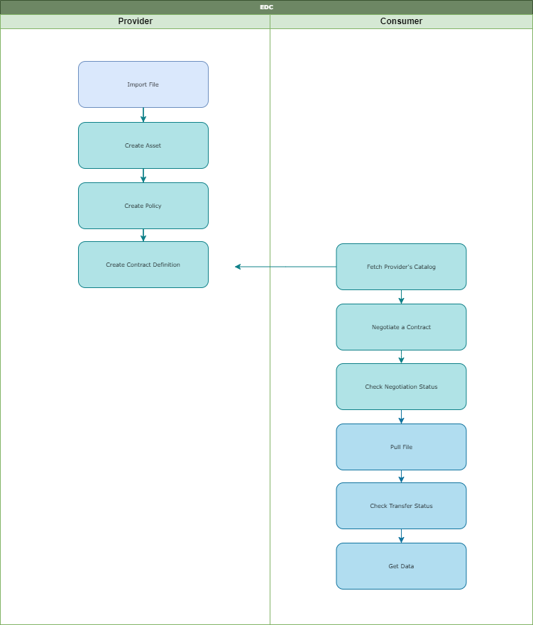

# WeForming Connector
----------------------------------

The WeForming Connector is based on Eclipse Dataspace Connector and provides a framework for sovereign, secure, inter-organizational data exchange. 
It's intended to support companies and individuals in loading information into a so-called dataspace and sharing this data. Furthermore, the connector supports retrieving and receiving data from other dataspaces. The EDC will implement the International Data Spaces (IDS) standard as well as relevant protocols and requirements associated with Gaia-X.

Dataspaces enable data cooperation in a multi-cloud federation by focusing on:
  - Identity: Each participant remains in control of their identity.
  - Trust: Each participant decides who to trust.
  - Sovereignty: Each participant decides under what policies their data is shared.
  - Interoperability: Each participant remains in control of their deployment.

This repo aims to demonstrate data exchange between edc connectors.

Each partner will need to run an instance of the **connector** to transfer data from or to his premisses. 

You can deploy the demo by using the multi-container **Docker** application from the main folder. It consists of two connectors with corresponding backend-services and databases, where one connector serves as a provider and the other one as a consumer. For testing purposes there is a **postman collection** enclosed that matches the predefined configurations of the connectors. Other resources, like config files, are placed in seperated subdirectories for both the connectors and the backend-services.


# Requirements
--------------
To run the project you will need:
- Docker


# Connector
-----------

The actual eclipse dataspace connector. 

Supported data requests are:
  - **Pull requests** (consumer asks for data access and receives an access token to pull the data async via http proxy.)
  - **Push requests** (consumer asks for data access and gets the data returned directly)
Not yet implemented:
  - **Data streaming**

## Port Mapping
Default port mapping:
| Description | Port | Path |
| :---------------- | :------: | :---- |
| Management | 8003 | /management |
| Control | 8005 | /control | 
| Protocol | 8004 | /protocol |
| Public | 8002 | /public |
| Default | 8001 | /api |

Ports must be enabled and must not be occupied!
In the demo the provider connector is configured to use the default mapping.

Check the connectors **alive status**:
GET http://<connector-host>:8001/api/alive

## Persistence
The connectors in this project store assets, policies, contract definitions, contract negotiations and transfer data persistently in a postgres database. 
The docker compose file takes care of the postgres setup and waits for a healty databases before it starts the connectors. The postgres containers will also be restarted automatically.


# edc-handler
-----------------
The edc-handler service is a simple file server that provides a local data storage. The files are saved in a table named edc_file_entity in postgress database. 
It also receives the connectors endpoint reference for any pull requests (context "/receiver").

Default port: 15588

Check the backend-service **alive status**:
http://<edc-handler>:15588/api/alive

# How to use
------------

Run the comntainers using ```docker compose up --build -d``` command.
When docker containers are running, load the collections inside postman folder and run the steps shown below. 


